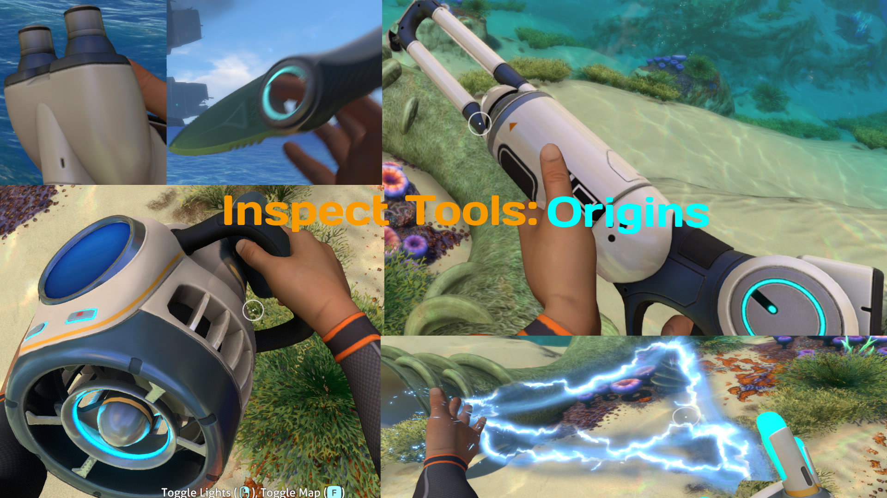

# Inspect Tools: Origins

**Allows You To Replay The First-Equip Animations Of Each Tool With The Press Of A Single Key!**

***

## **Features:-**

- **All Tools Supported:-** Supports All Current Tools Which Have An Animation!
- **Configurable:-** You Can Configure The KeyBind In The In-Game Settings.

## **Installation:-**

### **Vortex (Recommended):-**

1. Download Required Dependencies Using Their Installation Methods
2. Download This Mod Through The Files Tab Using **Mod Manager Download**
3. Enjoy!

### **Manual:-**

1. Download Required Dependencies Using Their Installation Methods
2. Download This Mod Through The Files Tab
3. Extract The Archive To Your `Subnautica\BepInEx\plugins` Folder
4. Enjoy!

***

## **Notes**:-

- This Is My Sixth Mod Ever (ATP, Should I Just Make This My Tag Line??).
- The Code Is Fully Open Source On
  My [Github](https://github.com/LabrynthKing/InspectToolsOrigins/tree/main/InspectToolsOrigins)
- My Discord Username Is `labrynthking`

## **Credits:-**

- **[The Nautilus Dev Team](https://www.nexusmods.com/subnautica/mods/1262):** For Their GREAT Library
- **[Tobey](https://www.nexusmods.com/profile/toebeann):** For
  Their [BepInEx Pack For Subnautica](https://www.nexusmods.com/subnautica/mods/1108)